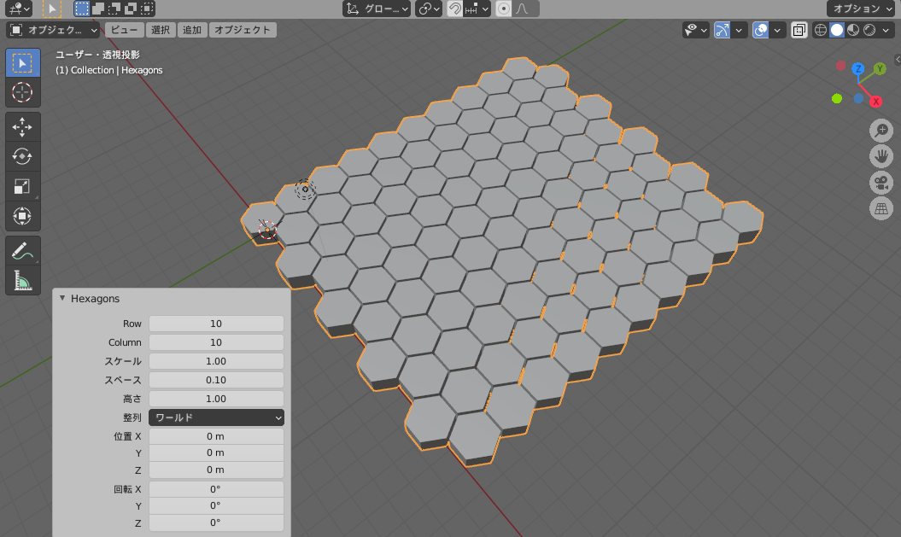

# Hexagons

均等に並んだ複数の六角形を作成する Blender のアドオン。

## 使用環境

Blender 2.80.0 以降

## 導入方法

1. このリポジトリをダウンロード
1. Blender のアドオンで「haxagons.py」をインストールし、チェックをつける

## 使い方

1. 追加ボタン -> メッシュ から「Hexagons」を選択
1. 各項目を設定する  
    - Row: 横方向の六角形の数
    - Column: 縦方向の六角形の数
    - スケール: 六角形の大きさ
    - スペース: 各六角形の間隔
    - 高さ： 六角形の高さ

## ライセンス

MIT License
